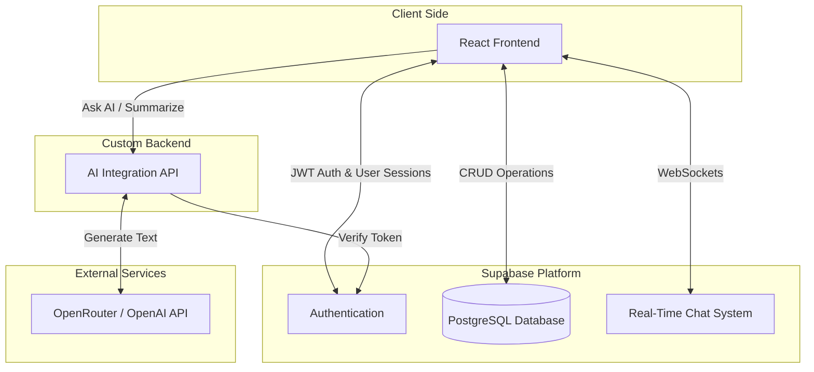

# Peer Learning Platform

<div align="center">


A modern peer-to-peer learning platform where students can connect, collaborate, share knowledge, and grow together through interactive learning sessions, real-time messaging, AI assistance, and community engagement.

---

[](https://react.dev/)
[](https://www.typescriptlang.org/)
[](https://tailwindcss.com/)
[](https://supabase.com/)
[](https://www.postgresql.org/)
[](LICENSE)

</div>

---

## Table of Contents

<!-- toc -->

- [Features](#%E2%9C%A8-features)
  * [Authentication System](#%F0%9F%94%90-authentication-system)
  * [User Profiles](#%F0%9F%91%A4-user-profiles)
  * [Peer Discovery](#%F0%9F%94%8D-peer-discovery)
  * [Learning Sessions](#%F0%9F%93%9A-learning-sessions)
  * [Real-Time Chat](#%F0%9F%92%AC-real-time-chat)
  * [AI-Powered Assistance](#%F0%9F%A4%96-ai-powered-assistance)
  * [Leaderboard System](#%F0%9F%8F%86-leaderboard-system)
  * [Personalized Dashboard](#%F0%9F%93%8A-personalized-dashboard)
  * [Modern Responsive UI](#%E2%9A%A1-modern-responsive-ui)
- [Screenshots](#%F0%9F%93%B8-screenshots)
- [Application Preview](#%F0%9F%93%B8-application-preview)
  * [Home Page](#%F0%9F%8F%A0-home-page)
  * [Authentication](#%F0%9F%94%90-authentication)
  * [Become a Mentor](#%F0%9F%91%A8%E2%80%8D%F0%9F%8F%AB-become-a-mentor)
  * [AI Assistant](#%F0%9F%A4%96-ai-assistant)
  * [Demo Video](#demo-video)
- [Problem Statement](#%F0%9F%A7%A0-problem-statement)
- [Tech Stack](#%F0%9F%9B%A0%EF%B8%8F-tech-stack)
- [Frontend](#%F0%9F%8E%A8-frontend)
- [Backend](#%E2%9A%99%EF%B8%8F-backend)
- [Authentication](#%F0%9F%94%90-authentication-1)
- [Deployment](#%F0%9F%9A%80-deployment)
- [System Architecture](#%F0%9F%8F%97%EF%B8%8F-system-architecture)
- [Project Structure](#%F0%9F%93%82-project-structure)
    + [Where to add new features?](#%F0%9F%93%9D-where-to-add-new-features)
- [Installation & Setup](#%E2%9A%99%EF%B8%8F-installation--setup)
  * [1Clone the Repository](#1%EF%B8%8F%E2%83%A3-clone-the-repository)
  * [2Navigate to Project Directory](#2%EF%B8%8F%E2%83%A3-navigate-to-project-directory)
  * [3Install Dependencies](#3%EF%B8%8F%E2%83%A3-install-dependencies)
  * [4Configure Environment Variables](#4%EF%B8%8F%E2%83%A3-configure-environment-variables)
  * [5Start Development Server](#5%EF%B8%8F%E2%83%A3-start-development-server)
  * [Technical Documentation](#%F0%9F%93%9A-technical-documentation)
- [Deployment](#%F0%9F%9A%80-deployment-1)
    + [Build Command](#build-command)
- [Troubleshooting](#%F0%9F%9B%A0%EF%B8%8F-troubleshooting)
- [Feature Roadmap](#%F0%9F%97%BA%EF%B8%8F-feature-roadmap)
- [Contributing](#%F0%9F%A4%9D-contributing)
  * [Steps to Contribute](#steps-to-contribute)
- [Contributors](#%F0%9F%92%96-contributors)
- [Author](#%F0%9F%91%A9%E2%80%8D%F0%9F%92%BB-author)
  * [Durdana Sultana](#durdana-sultana)
- [FAQ](#%E2%9D%93-faq)
- [Support](#%E2%AD%90-support)
- [License](#%F0%9F%93%9C-license)
  * [Empowering Students Through Collaborative Learning ](#%F0%9F%8C%9F-empowering-students-through-collaborative-learning-%F0%9F%8C%9F)

<!-- tocstop -->

---

# Features

## Authentication System
- Secure Signup & Login
- Protected Routes
- User Session Management

## User Profiles
- Personalized User Profiles
- Skills & Interests Showcase
- Learning Preferences

## Peer Discovery
- Find peers based on skills
- Connect with learners worldwide
- Smart matching system

## Learning Sessions
- Create study sessions
- Join collaborative learning groups
- Interactive peer discussions

## Real-Time Chat
- Instant messaging system
- Community interaction
- Smooth communication experience

## AI-Powered Assistance
- AI chatbot for learning support
- Smart recommendations
- Enhanced user guidance

## Leaderboard System
- Rankings based on activity.
- Community engagement rewards.
- Motivation through gamification.

## Personalized Dashboard
- Track learning progress
- Session overview
- Activity management

## Modern Responsive UI
- Fully responsive design
- Mobile-friendly interface
- Smooth user experience

---

# Screenshots

# Application Preview

## Home Page


---

## Authentication


---

## Become a Mentor


---


## AI Assistant


---
## Demo Video
 [Watch Demo ](
 https://github.com/user-attachments/assets/6af694a1-e98d-4d31-b99f-eeacddab3ebc)

# Problem Statement

Many students struggle to find suitable learning partners, mentors, and collaborative study environments.

The **Peer Learning Platform** solves this challenge by enabling students to connect, collaborate, and learn together through peer-to-peer knowledge sharing and community interaction.

---

# Tech Stack

| Category | Technologies |
|----------|--------------|
| **Frontend** | React 18, TypeScript, Vite |
| **UI & Styling** | Tailwind CSS, Radix UI, Shadcn UI, Framer Motion |
| **Backend** | Node.js, Express.js |
| **Database** | Supabase, PostgreSQL |
| **Authentication** | Supabase Authentication |
| **State Management & Data Fetching** | TanStack React Query |
| **Forms & Validation** | React Hook Form, Zod |
| **Charts & Data Visualization** | Chart.js, React Chart.js 2, Recharts |
| **API Communication** | Axios |
| **AI Integration** | OpenRouter API |
| **Video Conferencing** | Jitsi React SDK |
| **Testing** | Vitest, Playwright, Supertest, Testing Library |
| **Code Quality** | ESLint |
| **Deployment** | Vercel |
---

# System Architecture


##Architecture Overview

The Peer Learning Platform follows a modern full-stack architecture designed to provide scalability, maintainability, and real-time collaboration.

### Frontend Layer

- Built using **React 18**, **TypeScript**, and **Vite**.
- Uses reusable UI components powered by **Shadcn UI** and **Radix UI**.
- Handles routing, state management, authentication, and user interactions.
- Uses **TanStack React Query** for efficient server-state management.

### Backend Layer

- Built with **Node.js** and **Express.js**.
- Processes API requests.
- Handles AI assistant communication.
- Performs request validation and middleware processing.

### Database Layer

- **Supabase** provides:
  - PostgreSQL database
  - Authentication
  - Real-time subscriptions
  - Row Level Security (RLS)

### AI Integration

The backend securely communicates with the OpenRouter API using direct HTTP requests, keeping API keys server-side while providing intelligent learning assistance.

### Request Flow

```text
User
   |
   ?
React Frontend
   |
   ?
Express Backend
   |
   +--------------? AI APIs
   |
   ?
Supabase
   |
   ?
PostgreSQL Database
```

This layered architecture keeps the frontend, backend, and database responsibilities well separated, making the project easier to maintain and extend.

---
# Project Structure

```bash
peer-learning-platform/
|
+-- .github/                  # GitHub workflows, issue & PR templates
+-- .gssoc/                   # GSSoC related resources and documentation
+-- assets/                   # Static assets used across the project
+-- docs/                     # Technical documentation (API, Database, etc.)
+-- public/                   # Public static files served directly
|
+-- src/                      # Frontend source code
|   +-- assets/               # Images, icons and static resources
|   +-- components/           # Reusable React components
|   |   +-- chat/             # Chat related UI components
|   |   +-- dashboard/        # Dashboard components
|   |   +-- mentor/           # Mentor related components
|   |   +-- recommendations/  # Recommendation system UI
|   |   +-- resources/        # Learning resources components
|   |   +-- ui/               # Shared UI components (Shadcn/Radix)
|   |   +-- whiteboard/       # Collaborative whiteboard components
|   |
|   +-- config/              # Application configuration
|   +-- contexts/            # React Context providers
|   +-- hooks/               # Custom React hooks
|   +-- integrations/        # Supabase and third-party integrations
|   +-- lib/                 # Shared libraries and helper logic
|   +-- pages/               # Application pages and routes
|   +-- screenshots/         # README screenshots and application previews
|   +-- test/                # Frontend tests
|   +-- types/               # TypeScript type definitions
|   +-- utils/               # Utility/helper functions
|   +-- App.tsx              # Root React component
|   +-- main.tsx             # Application entry point
|
+-- backend/                 # Backend server
|   +-- controllers/         # Request handling logic
|   +-- middlewares/         # Authentication & request middleware
|   +-- routers/             # API route definitions
|   +-- tests/               # Backend tests
|   +-- utils/               # Backend utility functions
|   +-- validation/          # Request validation schemas
|   +-- app.js               # Express application
|   +-- server.js            # Server entry point
|
+-- supabase/                # Database configuration and migrations
+-- package.json             # Project dependencies and scripts
+-- vite.config.ts           # Vite configuration
+-- tailwind.config.ts       # Tailwind CSS configuration
+-- tsconfig.json            # TypeScript configuration
+-- CONTRIBUTING.md          # Contribution guidelines
+-- TROUBLESHOOTING.md       # Common issues and fixes
+-- README.md                # Project documentation
```

## Where should you make changes?

The table below helps contributors quickly locate the correct directory based on the feature they want to work on.

| If you want to... | Modify this location |
|-------------------|----------------------|
| Create a new page | `src/pages/` |
| Build reusable UI components | `src/components/ui/` |
| Modify chat functionality | `src/components/chat/` |
| Improve dashboard features | `src/components/dashboard/` |
| Work on mentor-related features | `src/components/mentor/` |
| Add recommendation features | `src/components/recommendations/` |
| Update the collaborative whiteboard | `src/components/whiteboard/` |
| Add custom React Hooks | `src/hooks/` |
| Manage global state or contexts | `src/contexts/` |
| Configure Supabase integration | `src/integrations/` |
| Add helper or utility functions | `src/utils/` |
| Add backend API endpoints | `backend/routers/` |
| Implement backend business logic | `backend/controllers/` |
| Create middleware | `backend/middlewares/` |
| Add request validation | `backend/validation/` |
| Write backend tests | `backend/tests/` |
| Update technical documentation | `docs/` |

---

# Installation & Setup

## 1Clone the Repository

```bash
git clone https://github.com/durdana3105/peer-learning.git
```

---

## 2Navigate to Project Directory

```bash
cd peer-learning
```

---

## 3Install Dependencies

```bash
npm install
```

---

## 4Configure Environment Variables

A `.env.example` file is provided in the root of the repository with all required variable names and placeholder values. Copy it to `.env` before running the project:

```bash
cp .env.example .env
```

Then fill in your actual values in `.env`. You can get your Supabase credentials from [https://supabase.com/dashboard](https://supabase.com/dashboard).

Create a `.env` file in the root directory and add:
```env
VITE_SUPABASE_URL=your_supabase_url
VITE_SUPABASE_ANON_KEY=your_supabase_anon_key
```

---

## 5Start Development Server

```bash
npm run dev
```

---

## Technical Documentation
For deeper technical insights, please refer to our dedicated documentation:
- [Database Architecture & Schema](./docs/database.md)
- [API Documentation](./docs/api.md)

---
# Development Workflow

Follow the workflow below when contributing to the project:

```text
Issue Assignment
        |
        ?
Fork the Repository
        |
        ?
Clone Repository
        |
        ?
Create a Feature Branch
        |
        ?
Install Dependencies
        |
        ?
Implement Changes
        |
        ?
Run Tests & Lint
        |
        ?
Commit Changes
        |
        ?
Push Branch
        |
        ?
Open Pull Request
        |
        ?
Code Review
        |
        ?
Merge into Main Branch
```

## Development Process

1. Fork the repository.
2. Clone it to your local machine.
3. Create a new feature or bug-fix branch.
4. Install all required dependencies.
5. Implement your changes following the project structure.
6. Run linting and tests before committing.
7. Commit your changes with a meaningful commit message.
8. Push the branch to GitHub.
9. Open a Pull Request for review.
10. Address review comments (if any) and wait for approval.

---

# Deployment

This project can be easily deployed on:

- Vercel
- Netlify
- Render

### Build Command

```bash
npm run build
```

---

# Troubleshooting

If you encounter issues during setup, installation, or configuration, please refer to our [Troubleshooting Guide](TROUBLESHOOTING.md) for solutions to common problems.

---

# Feature Roadmap

Our development roadmap is structured to provide clear visibility into the project's priorities and progress. 

### Completed ?
- **Secure Authentication**: Email/Password and OAuth integration.
- **Real-Time Chat & Study Sessions**: Live messaging and collaborative learning environments.
- **Gamification System**: XP, levels, leaderboards, and streak counts.

### In Progress - **Session Scheduling**: Plan study sessions ahead of time. (Target: Q3)
- **AI-based Peer Recommendations**: Smart matching system for peers. (Target: Q3)

### Planned - **Video Calling Integration**: Seamless face-to-face peer collaboration. (Target: Q4)
- **Real-time Notifications**: Alerts for new messages and upcoming sessions. (Target: Q4)
- **Mentor Matching System**: Dedicated workflows for connecting students with mentors. (Target: Q1 2027)
- **Multi-language Support**: Expanding accessibility for a global audience. (Target: Q1 2027)
- **Dedicated Mobile App**: Native applications for iOS and Android. (Target: 2027)

---

# Contributing

Contributions are welcome ## Steps to Contribute

1. Fork the repository
2. Create a new branch

```bash
git checkout -b feature-name
```

3. Make your changes.
4. Commit your changes.

```bash
git commit -m "Add your message"
```

5. Push to GitHub

```bash
git push origin feature-name
```

6. Open a Pull Request ---

# Contributors

Thanks to all the amazing people who contribute to **Peer Learning** <p align="center">
  <a href="https://github.com/durdana3105/peer-learning/graphs/contributors">
    
  </a>
</p>

---

# Author

## Durdana Sultana
Computer Science (AI & ML) Student

---

# Support

If you like this project, please give it a ? on GitHub.

<p align="center">

<a href="https://github.com/durdana3105/peer-learning/stargazers">
  
</a>

<a href="https://github.com/durdana3105/peer-learning/network/members">
  
</a>

</p>

## FAQ

### Q: How do I set up the project locally?
A: Clone the repo, install dependencies, copy `.env.example` to `.env`, fill in Supabase values, then run the development server.

```bash
git clone https://github.com/durdana3105/peer-learning.git
cd peer-learning
npm install
cp .env.example .env
# Update .env with your Supabase values
npm run dev
```

> **Note:** This project standardizes on **npm**. The committed lockfile is `package-lock.json`, and CI/deployment run `npm ci`. Please do not commit lockfiles from other package managers (e.g. `bun.lock`, `bun.lockb`, `yarn.lock`, `pnpm-lock.yaml`).

### Q: What environment variables are required?
A: Your frontend needs `VITE_SUPABASE_URL` and `VITE_SUPABASE_ANON_KEY` (or supported aliases such as `NEXT_PUBLIC_SUPABASE_URL` / `NEXT_PUBLIC_SUPABASE_ANON_KEY`).

The backend uses `SUPABASE_URL` and either `SUPABASE_SERVICE_ROLE_KEY` or `SUPABASE_ANON_KEY` as well as `OPENROUTER_API_KEY` for AI chat and `SITE_URL` where applicable.

### Q: How should I configure Supabase?
A: Create a Supabase project and copy the project URL and anon key into `.env`. Enable Supabase Auth, add the required authentication providers, and make sure your auth redirect URL matches your local or deployed site.

### Q: How can I deploy this project?
A: This repository is configured for Vercel deployment. Deploy the frontend and backend to Vercel, then add the same Supabase environment variables to your Vercel project settings.

For local deployment, ensure your `.env` variables are correct and run `npm run dev` for development or `npm run build` then `npm run preview` for production preview.

### Q: Why does authentication fail even though I set up Supabase?
A: Common causes:
- `.env` variables are missing, wrong, or not loaded.
- The site URL in Supabase Auth settings does not match your local URL (`http://localhost:5173`) or deployed URL.
- OAuth provider callback URLs are not configured correctly.

Verify the keys and URLs carefully in both Supabase and the app.

### Q: What should I do if the app still fails to start?
A: Check these steps:
- Confirm `.env.example` was copied to `.env` and values were filled.
- Run `npm install` again after deleting `node_modules` if dependencies appear broken.
- Make sure your Node.js version is compatible with the repo (CI uses Node 20.x).
- Look for console errors from the frontend or backend and verify the Supabase credentials.

---

# License

This project is licensed under the MIT License.

---

<div align="center">

## Empowering Students Through Collaborative Learning Made with by the Open Source Community

</div>
# TODO: [bug]: validation error message doesn't clear after fixing the issue (skills & experience steps) (#1614)
# Minor update

